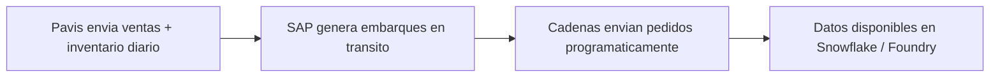
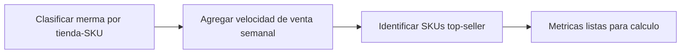
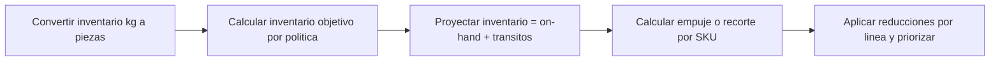
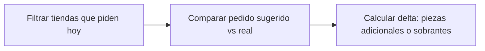
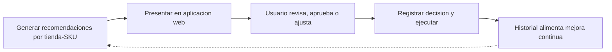
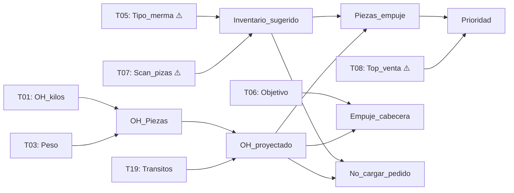
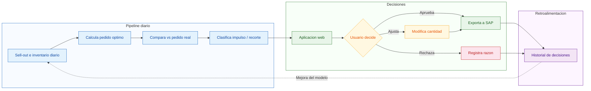
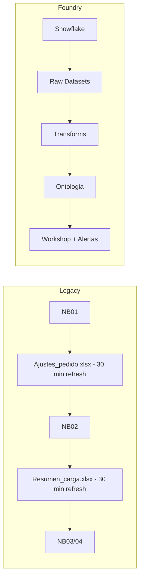
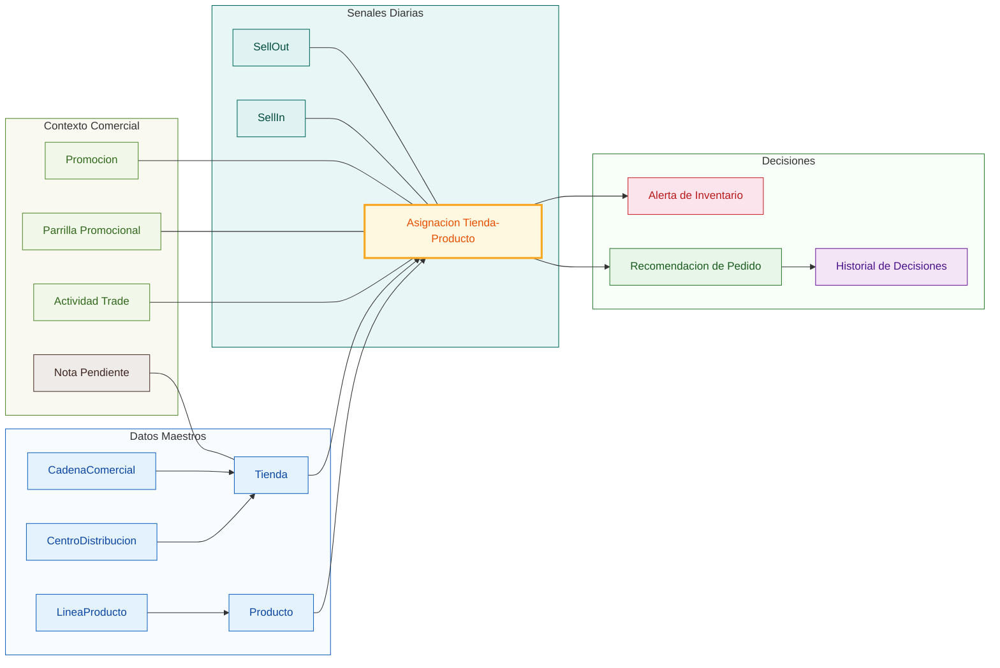
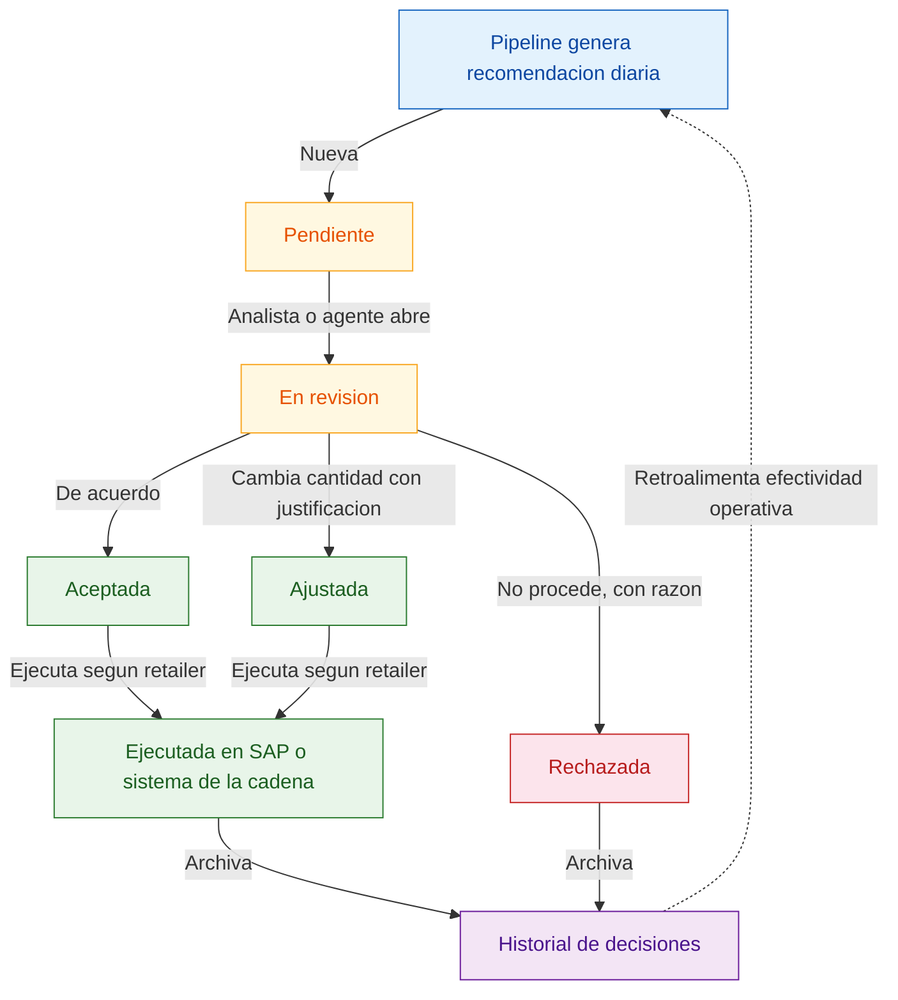

# Pedido Optimo — Validacion para Desarrollo en Foundry

**Fecha**: 2026-04-07 | **De**: Solanthic / Alfonso Garrido | **Para**: Enrique Morales, Victor Perezo
**Fecha limite**: Necesitamos respuestas antes del **2026-05-04** (transicion de Enrique)

---

Hemos analizado a fondo los 10 queries SQL, 5 notebooks de Python y 83 datasets en Foundry. **La buena noticia**: toda la logica desde `my_query1.sql` y los notebooks NB01-NB05 esta verificada y lista para implementar. **El problema**: hay 5 piezas de logica upstream que no tenemos documentadas y sin las cuales no podemos arrancar.

Este documento tiene 3 secciones:

1. **Preguntas para Enrique** — lo que necesitamos para construir
2. **Datos necesarios en Foundry** — tablas y configuracion de Snowflake
3. **Vision Foundry** — que vamos a construir y como mejora el proceso actual

---

## 1. Preguntas para Enrique

> **Nota sobre el enfoque**: Nuestro objetivo es primero **replicar fielmente la logica existente** en Foundry — asegurar que produce los mismos resultados que el pipeline actual. Una vez replicado, vamos a **mejorar iterativamente** incorporando el feedback del piloto en Pachuca, la intuicion operativa del equipo, y metodos data-driven que aprovechen los datasets completos de Sigma. Foundry permite correr analitica performante sobre millones de filas, lo que abre la puerta a decisiones basadas en datos que hoy no son posibles por limitaciones de escala y herramientas. Las preguntas a continuacion buscan entender la logica actual para poder replicarla correctamente como primer paso.

### Blockers — Sin esto no podemos arrancar

#### E1: Como se clasifica Tipo_merma?

Esta variable controla el 100% del calculo de inventario sugerido (`my_query1.sql` L51-75). Sabemos que existen 6 categorias (Ok, Alta, Muy Alta, Scritica, Critica, Inconsistente) y que hay granularidades anual y trimestral. Lo que nos falta:

- **Cuales son los umbrales?** Ej: POR_MERMA < 5% = Ok, 5-10% = Alta?
- **Es basado en reglas fijas o en un modelo estadistico?**
- **La columna `POR_MERMA` en `mermas_autos_test_pedido_sugerido` es el input directo?**
- **El pipeline usa la granularidad trimestral?**
- **Frecuencia de recalculo?** Y como se clasifican SKUs nuevos sin historico?

> Sin esta logica, no podemos clasificar nuevos tienda-SKUs ni recuperarnos si los datos se vuelven obsoletos.

#### E2: Como se agrega Scan_pizas?

El denominador de toda la formula de inventario (`(Scan_pizas / 7) * dias`). Tenemos los datos diarios crudos (`sell_out_oh_diarios_28`) pero no sabemos como se agregan a semanal:

- **Ventana**: Movil 28 dias? 4 semanas calendario?
- **Conversion kilos a piezas**: Simple division por Peso?
- **Outliers**: Se excluyen picos promocionales o dias sin venta?
- **Ponderacion**: Promedio simple o recientes pesan mas?

> En Foundry podemos computar esto directamente desde los datos diarios — solo necesitamos confirmar el metodo para replicar exactamente el resultado actual.

#### E3: Inventario_sugerido vs Inventario_optimo — cual es el bueno?

Encontramos dos modelos diferentes:

|               | Modelo NB01 (`my_query1.sql`)       | Modelo TC_RL (`my_query.sql`)      |
| ------------- | ----------------------------------- | ---------------------------------- |
| Formula       | `(Scan_pizas / 7) * dias_por_merma` | Pre-computado, logica desconocida  |
| Alcance       | Todas las combinaciones             | Solo Clase='RL' (95 filas Pachuca) |
| Uso operativo | Distribuido diariamente             | Desconocido                        |

- **Cual es el que operaciones usa hoy?**
- **TC_RL es un modelo mas nuevo que deberia reemplazar a NB01?**
- **Si ambos se usan, como se reconcilian?**

---

### Importantes — Afectan calidad del output

#### E4: Como se generan los rankings Top_venta y Top_tienda?

Usados en `Prioridad` (NB01) y en PDFs de alerta (`my_query3.sql`). Necesitamos:

- Metrica de ranking (volumen? margen?), alcance (tienda? CEDI? nacional?), ventana de tiempo, frecuencia de recalculo
- Son `Sku_insignia` (T08) y `top_tienda_nacional` (T11) rankings diferentes o derivados del mismo?

#### E5: Confirmar el camino de datos diarios de sell-out hacia Snowflake

Hemos identificado que el flujo actual es: **Pavis (scanners retailer) → SQL Server (`mermas_autos_cabeceras_oh_SCAN` en `SIACECLU04\SIACESQLQAS`) → export estatico `sell_out_oh_diarios_28`**. Este dato **no esta en Snowflake** — es el blocker #1 para Foundry.

- **Confirmas que este es el flujo correcto?** Pavis → SQL Server → ...?
- **Cual es el camino mas directo para llegar a Snowflake?** Idealmente un sync incremental diario desde SQL Server
- **Solo hay 28 dias moviles o hay historico mas profundo?** Para Foundry seria valioso tener mas profundidad historica

> **Nota sobre transitos y ordenes de cliente**: Actualmente `transitos.csv` se extrae manualmente de SAP y se carga con `pd.read_csv('transitos.csv', encoding='latin1')` en NB01. Las ordenes de cliente (`proyeccion_detalle_pedidos`) vienen programaticamente desde la aplicacion web en HostGator (MySQL) — estas ya estan migradas a Snowflake como `SOP_PROYECCION_DETALLE_PEDIDOS` (108K filas). Para Foundry, necesitamos que **ambos flujos lleguen como datasets desde Snowflake**: los transitos idealmente directo de SAP → Snowflake (sin CSV manual), y las ordenes de cliente ya estan resueltas.

#### E6: Las tablas promocionales son manuales o calculadas?

`mermas_autos_cabeceras` (T06), `parrrillas` (T09), `actividad_trade` (T15) — las captura manualmente el equipo comercial? O son generadas por algun proceso? Necesitamos saber para decidir si se migran como datos crudos o si necesitamos replicar logica.

---

### Confirmaciones Rapidas

- **E7**: `'Scritica'` en `my_query1.sql` L63 (multiplicador 8 dias) — es intencional o deberia ser 'Subcritica'?
- **E8**: El factor 0.33 para Q-FRESCOS en NB01 — entendemos que se definio por intuicion operativa. Para Foundry queremos construir una logica data-driven: analizar las tasas reales de merma/caducidad por linea de producto y calcular el factor optimo de reduccion para cada una — no solo para Q-FRESCOS sino para cualquier familia que lo necesite. **Confirmas que 0.33 fue por criterio experto? Hay datos de merma por linea que podamos usar para calibrar?**
- **E9**: Los multiplicadores de dias (Ok=14, Alta=12, Muy Alta=10, Scritica=8, Critica=7) — basados en datos historicos o juicio experto?

---

## 2. Datos Necesarios en Foundry

Ya existen **43 datasets `IND_*` en Foundry** con schemas correctos para todas las tablas del pipeline (T01-T17). La mayoria tienen schema pero **0 filas** — necesitamos que se ejecuten los syncs y se configure Snowflake para soportar las cargas completas.

### Prioridad 1: Ejecutar syncs de datos

| Accion                                                                                          | Impacto                                                                                             |
| ----------------------------------------------------------------------------------------------- | --------------------------------------------------------------------------------------------------- |
| **Ejecutar syncs de todos los datasets IND_***                                                  | Es el mayor desbloqueante. Schemas listos, 0 filas. Con datos, tenemos T01-T17 completas en Foundry |
| **Configurar Snowflake para cargas grandes** (SHARING_SELLIN 865M filas, TBL_RM_CTX 664M filas) | Estrategia incremental por YEAR_WEEK lista — requiere resolver conectividad para ejecutar           |

### Prioridad 2: Tablas adicionales

| Tabla                                                                           | Necesidad                                                         |
| ------------------------------------------------------------------------------- | ----------------------------------------------------------------- |
| **Transitos** (T19) — unico dataset sin IND_*                                   | Sin transitos, el inventario proyectado se subestima. Fuente: SAP |
| Verificar: SOP_PAC_EMPLOYEES_COMERCIAL contiene Cel_ejecutivo/Cel_coordinadora? | Podria cubrir T12 (directorio WhatsApp) sin migracion adicional   |
| Verificar: SOP_PAC_PROMOCIONES tiene mismo schema que parrrillas?               | Podria cubrir T09                                                 |

### Estado actual de datasets con datos

Solo 3 de 43 IND_* sincronizaron datos hasta ahora: IND_DIRECTORIO_WHATSAPP (73 filas), IND_ACTIVIDAD_TRADE (673), IND_INVENTARIO_FISICO (1,601). El resto son schema-only.

---

## 3. Vision Foundry — Que Vamos a Construir

### Lo que hemos validado y esta listo para implementar

Analizamos cada archivo del pipeline legacy y verificamos la logica formula por formula contra el codigo fuente:

`**my_query1.sql`** — el query principal que construye la base del pedido:

- Conversion de inventario de kilos a piezas (`OH_Piezas = OH_kilos / Peso`), con redondeo diferenciado para GRANEL (2 decimales) vs empacado (enteros)
- Calculo de inventario sugerido por clasificacion de merma: multiplicadores de dias de cobertura (Ok=14d, Alta=12d, Muy Alta=10d, Scritica=8d, Critica=7d)
- Flags de reactivacion (2 tipos: operacion vs central, segun si Tipo_merma es NULL)
- Vigencia de cabeceras y parrillas promocionales (BETWEEN fechas)
- Flags operativos: Activa_cliente, Puede_pedir_op

`**01_RL_TC_con_transitos.ipynb**` (NB01) — el calculo core del pedido sugerido:

- Inventario proyectado = On-hand + transitos en camino
- Piezas de empuje = solo cuando Tipo_merma es 'Ok' y el inventario sugerido supera al proyectado
- Reduccion del 67% para productos Q-FRESCOS (factor 0.33)
- Flag de recorte para combinaciones con merma alta y sobreinventario
- Priorizacion: 1 (empuje + top-seller), 2 (empuje + no-top), 0 (sin empuje)
- Empuje por cabecera promocional cuando la promo esta activa

`**02_Compara_pedidos.ipynb**` (NB02) — comparacion vs pedidos reales:

- Filtro por dia de la semana usando tabla de roles
- Delta entre pedido sugerido y pedido original de la cadena

**NB03/NB04/NB05** — generacion y distribucion de alertas:

- PDFs con secciones color (azul=impulso, rojo=merma alta, verde=promos, cafe=notas)
- Exclusion Wal-Mart GRANEL, ruteo especifico Soriana
- Acumulacion historica con deduplicacion

**Todo esto esta documentado, verificado, y listo para traducir a transforms de Foundry.** Lo que falta es la logica upstream (preguntas E1-E4).

### Como fluye el proceso

**Paso 1 — Ingesta diaria de datos**

**Paso 2 — Clasificacion y metricas** ⚠️ Requiere respuestas E1-E4

**Paso 3 — Calculo de pedido optimo** ✅ Verificado

**Paso 4 — Comparacion vs pedido real** ✅ Verificado

**Paso 5 — Decisiones y ejecucion** ✅ Verificado

### Que tablas alimentan que calculos

> ⚠️ = logica desconocida, depende de respuestas E1-E4

---

### Mejoras que vamos a construir en Foundry

Mas alla de replicar el pipeline actual, Foundry nos permite mejorar significativamente el proceso. Estas son las mejoras que planeamos implementar:

#### 1. Parametros configurables por el usuario

Hoy los valores criticos estan hardcoded en el SQL y Python. En Foundry, operaciones podra ajustarlos directamente sin tocar codigo:

| Parametro                           | Hoy (hardcoded)                              | En Foundry (editable por usuario)                                   |
| ----------------------------------- | -------------------------------------------- | ------------------------------------------------------------------- |
| Dias de cobertura por tipo de merma | Ok=14, Alta=12, etc. fijo en `my_query1.sql` | Configurable por politica — el usuario puede ajustar por tienda-SKU |
| Factor de reduccion Q-FRESCOS       | 0.33 fijo en NB01                            | Configurable por linea de producto — se pueden agregar otras lineas |
| CEDI de ejecucion                   | 'Pachuca' hardcoded                          | Parametro de ejecucion — corre por CEDI o nacional                  |
| Clasificacion de merma              | Proceso externo, opaco                       | Umbrales visibles y ajustables, con historial de cambios            |

#### 2. Visibilidad diaria de sell-in y sell-out

Actualmente no hay una vista unificada de las senales de demanda y oferta. En Foundry construiremos:

- **Sell-out diario**: Inventario on-hand + ventas escaneadas a nivel tienda-SKU-dia, con tendencias y comparacion historica
- **Sell-in diario**: Pedidos de cadena + embarques en transito, con seguimiento de entregas
- **Vista cruzada**: Comparacion directa entre lo que se vende (sell-out) y lo que se envia (sell-in) para detectar desbalances por tienda, cadena, o CEDI
- **Dashboards operativos**: Visualizacion en tiempo real del estado de inventario y velocidad de venta

#### 3. Deteccion de picos de venta (sales spikes)

El pipeline actual no detecta cuando las ventas son anomalas. Un pico promocional infla `Scan_pizas` y produce recomendaciones infladas. En Foundry:

- Deteccion automatica de spikes comparando la semana actual vs el promedio movil
- Opcion de excluir periodos promocionales del calculo de velocidad base
- Alertas cuando un SKU muestra velocidad anomala, para revision manual antes de generar pedido

#### 4. Inventario fantasma mejorado

Discutido en la sesion del 2026-03-30: el umbral universal de 21 dias sin venta produce falsos positivos para productos de vida larga (cafe, mantequilla). Mejoras:

- Reemplazar el umbral fijo de 21 dias por un **umbral por SKU** basado en la cadencia historica de ventas de ese producto
- Diferenciar por categoria y vida de anaquel
- Tratamiento especial para productos de innovacion (no zerear como productos establecidos)
- Analisis de frecuencia vs cantidad para distinguir si el problema es que no se vende o que se vende poco

#### 5. Politicas granulares a nivel tienda-SKU

En vez de aplicar la misma regla a todas las combinaciones, permitir configuracion granular:

- `**diasObjetivoInventario`** configurable por tienda-SKU (default segun clasificacion de merma, pero sobreescribible)
- Politicas diferenciadas por cadena (Walmart vs Soriana vs Chedraui tienen dinamicas de inventario diferentes)
- Umbrales de empuje y recorte ajustables por categoria de producto
- Historial de cambios de politica para auditoria

#### 6. Ciclo de recomendacion de pedido optimo — la mejora principal

Hoy el pipeline calcula un pedido sugerido y lo distribuye como alerta unidireccional — no hay forma de saber si la recomendacion fue util, si se actuo sobre ella, o si el modelo necesita ajuste. En Foundry vamos a cerrar este ciclo: el sistema genera una recomendacion, el usuario la revisa y decide, la decision se registra, y el historial alimenta la mejora continua del modelo. Esto aplica para todos los retailers, adaptandose al flujo de ejecucion de cada cadena (Walmart opera con ajustes de forecast, Soriana con promotores, etc.).

**Diferencia vs hoy**: El pipeline actual genera una alerta y la envia. No hay feedback. No hay tracking. No hay forma de mejorar el modelo. Con este ciclo, cada decision queda registrada — que recomendo el sistema, que decidio el humano, y por que — lo que permite medir la calidad del modelo y mejorarlo con datos reales.

#### 7. Agentes de IA para monitoreo y triaje de alertas

Vamos a implementar **agentes de IA** que operan a nivel tienda y cadena para mejorar la calidad de las alertas:

- **Monitoreo diario automatizado**: Agentes que revisan el estado de inventario por tienda/retailer y detectan patrones que requieren atencion (desabasto recurrente, sobreinventario cronico, tendencias de merma)
- **Triaje inteligente de alertas**: En vez de enviar todas las alertas por igual, los agentes clasifican y priorizan — alertas criticas primero, agrupadas por tienda/cadena, con contexto relevante
- **Recomendaciones y alertas diarias**: El ciclo de recomendacion se ejecuta diariamente, generando un historial completo de alertas. Cada alerta generada queda registrada con su estado (generada → distribuida → reconocida → resuelta)
- **Historial de alertas**: Registro append-only de todas las alertas generadas, con metricas de tiempo de respuesta, tasa de resolucion, y patrones recurrentes. Esto permite identificar tiendas o SKUs que consistentemente generan alertas sin resolucion
- **Adaptacion por retailer**: Los agentes entienden las diferencias operativas entre cadenas (Walmart permite ajustes de forecast, Soriana opera con promotores, etc.) y adaptan la comunicacion y las acciones recomendadas

#### 8. Eliminacion de intermediarios Excel

El pipeline actual depende de dos archivos Excel con automatizacion COM que tarda 30 minutos cada uno:

En Foundry: transforms directos, minutos en vez de hora, sin dependencia de Windows, ejecutable en la nube.

#### 9. Escala nacional

Todo el SQL actual esta filtrado por `CEDI = 'Pachuca'`. Foundry permite parametrizar y ejecutar para cualquier CEDI o a nivel nacional, con rankings que se computan primero a nivel nacional y luego se filtran por ambito de ejecucion.

---

### Ontologia Propuesta

Para soportar las mejoras anteriores, diseñamos un modelo de datos (ontologia) en Foundry. Este es el **conjunto core inicial** — lo validaremos juntos y lo expandiremos segun las necesidades operativas que surjan.

#### Datasets que alimentan la ontologia

Estos son los datos que ya tenemos (o estamos por sincronizar) y como se traducen a objetos en Foundry:

| Dato Fuente                                                    | Dataset         | Que Modela en Foundry                                                                                             |
| -------------------------------------------------------------- | --------------- | ----------------------------------------------------------------------------------------------------------------- |
| Catalogo de tiendas + roles de pedido + directorio de contacto | T02 + T10 + T12 | **Tienda** — cada punto de venta con su configuracion de dias de pedido y contactos                               |
| Catalogo de SKUs con peso y clasificacion                      | T03             | **Producto** — cada SKU con atributos para la conversion kg→pzas                                                  |
| Combinaciones activas tienda-SKU                               | T04 + T05       | **AsignacionTiendaProducto** — el objeto central donde vive la politica de inventario y las metricas del pipeline |
| Inventario + ventas diarias (Pavis)                            | T01             | **SellOut** — senal de demanda diaria por tienda-SKU                                                              |
| Pedidos de cadena + embarques en transito                      | T18 + T19       | **SellIn** — senal de oferta diaria por tienda-SKU                                                                |
| Cabeceras promocionales                                        | T06             | **Promocion** — objetivos de inventario por promocion activa                                                      |
| Parrillas promocionales                                        | T09             | **ParrillaPromocional** — membresia en campanas con vigencia                                                      |
| Actividades trade                                              | T15             | **ActividadTrade** — eventos con precios sugeridos                                                                |
| Notas de credito/debito                                        | T13             | **NotaPendiente** — contexto financiero por tienda                                                                |
| Cadenas comerciales (distinct de T02)                          | T02             | **CadenaComercial** — Walmart, Soriana, etc. con su modelo de ejecucion                                           |
| CEDIs (distinct de T02)                                        | T02             | **CentroDistribucion**                                                                                            |
| Lineas de producto (distinct de T03)                           | T03             | **LineaProducto** — con factor de reduccion configurable (ej. Q-FRESCOS)                                          |

#### Que queremos modelar

**Asignacion Tienda-Producto** (amarillo, centro) es el objeto core — conecta datos maestros (azul), senales diarias de sell-in/sell-out (teal), genera recomendaciones y alertas (verde/rojo), y se enriquece con contexto comercial (verde claro). El historial (morado) registra cada decision.

#### Objeto central: AsignacionTiendaProducto

Este es el **corazon del sistema**. Cada combinacion tienda-SKU activa tiene una asignacion que combina:

- **Configuracion editable** (el usuario puede cambiar): dias objetivo de inventario, si esta activa, flag de operacion, politica de inventario
- **Metricas del pipeline** (el sistema computa): inventario proyectado, piezas de empuje, flag de recorte, prioridad, clasificacion de merma, velocidad de venta

#### Ciclo de vida de las recomendaciones

Cada dia, el pipeline analiza cada combinacion tienda-SKU y genera una **recomendacion**: cuantas piezas deberian ordenarse (impulso), cuantas deberian recortarse (recorte), o si el pedido actual esta bien (sin cambio). Cada recomendacion incluye la cantidad sugerida, la prioridad, el tipo de merma, y la comparacion contra el pedido real de la cadena.

Estas recomendaciones pasan por un ciclo de revision donde tanto el **equipo de operaciones** como **agentes de IA** pueden tomar acciones — aprobar, ajustar con justificacion, o rechazar con razon. Los agentes pueden pre-aprobar recomendaciones de baja complejidad o triagear alertas, mientras que las decisiones de alto impacto requieren revision humana. Cada decision queda registrada (quien la tomo, humano o agente, y por que) para auditoria y para medir la efectividad operativa con el tiempo.

#### Acciones disponibles

| Accion                                           | Que Permite                                                            |
| ------------------------------------------------ | ---------------------------------------------------------------------- |
| Aprobar / Rechazar / Sobreescribir recomendacion | Ciclo de decision individual                                           |
| Aprobacion masiva                                | Aprobar multiples recomendaciones en lote (ej. por prioridad o tienda) |
| Sobreescribir politica de inventario             | Cambiar dias objetivo por tienda-SKU especifico                        |
| Sobreescribir forecast                           | Ajuste especifico para Walmart                                         |
| Reconocer / Resolver alerta                      | Ciclo de vida de alertas con notas obligatorias                        |
| Activar / Desactivar tienda o tienda-producto    | Gestion de activaciones con cascada                                    |

#### Como evolucionara

Esta ontologia es el **conjunto core** basado en lo que conocemos hoy del pipeline. A medida que avancemos:

- **Validaremos** cada objeto contra la operacion real — si un objeto no agrega valor, lo simplificamos o absorbemos
- **Expandiremos** cuando surjan necesidades: nuevas metricas, nuevos tipos de alerta, integraciones con otros sistemas
- **Refinaremos** las acciones basadas en como el equipo realmente usa el sistema — las acciones que no se usen se eliminan, las que falten se agregan
- El objetivo es que la ontologia refleje **como opera el negocio**, no como estan estructuradas las tablas de origen

---

### Aplicaciones para el Equipo

Vamos a construir 5 aplicaciones en Foundry Workshop — cada una con un proposito especifico y un conjunto acotado de acciones. Son el punto de contacto entre el equipo y el sistema.

#### 1. Centro de Pedidos

La aplicacion principal de operaciones diarias. Aqui es donde el equipo revisa las recomendaciones del pipeline y toma decisiones.

| | |
|---|---|
| **Que hace** | Muestra las recomendaciones diarias por tienda-SKU: impulso, recorte, o sin cambio. Permite aprobar, ajustar cantidad (con justificacion), o rechazar (con razon) — individual o en lote. Muestra el delta entre pedido sugerido y pedido real de la cadena. |
| **Quien lo usa** | Analistas de CEDI, equipo de operaciones |
| **Acciones** | Aprobar, Rechazar, Sobreescribir cantidad, Aprobacion masiva |
| **Datos clave** | Recomendacion de Pedido, Asignacion Tienda-Producto, Alerta de Inventario |

#### 2. Pulso de Inventario

La torre de control. Vista en tiempo real de la salud del inventario a traves de tiendas, cadenas y CEDIs.

| | |
|---|---|
| **Que hace** | Visualiza sell-in vs sell-out diario con tendencias historicas. KPIs de fill rate, alertas activas, sobreinventario y desabasto. Deteccion de picos de velocidad anomala. Filtrable por cadena, CEDI, linea de producto. |
| **Quien lo usa** | Gerencia, lideres de CEDI, equipo comercial |
| **Acciones** | Reconocer alerta, drill-down a tienda/SKU especifico |
| **Datos clave** | SellOut, SellIn, Alerta de Inventario, Tienda, Producto |

#### 3. Monitor de Agentes

Transparencia sobre las acciones de los agentes de IA. Todo lo que un agente hizo es visible, auditable, y reversible.

| | |
|---|---|
| **Que hace** | Log de cada accion tomada por agentes: pre-aprobaciones, triajes de alertas, escalaciones. Permite sobreescribir cualquier decision de un agente. Metricas de alineacion: con que frecuencia las decisiones del agente coinciden con las del equipo humano. |
| **Quien lo usa** | Gerencia, administradores del sistema |
| **Acciones** | Sobreescribir decision de agente, ajustar reglas de triaje |
| **Datos clave** | Historial de Recomendaciones, Alerta de Inventario |

#### 4. Gestor de Politicas

Donde se configuran las reglas del juego. Cada parametro que hoy esta hardcoded en el codigo pasa a ser editable aqui.

| | |
|---|---|
| **Que hace** | Configura dias objetivo de inventario por tienda-SKU (con default por clasificacion de merma). Administra factores de reduccion por linea de producto (ej. Q-FRESCOS). Activa/desactiva combinaciones tienda-producto. Historial completo de cambios de politica. |
| **Quien lo usa** | Gerencia, administradores del sistema |
| **Acciones** | Sobreescribir politica de inventario, Activar/Desactivar tienda-producto, configurar umbrales |
| **Datos clave** | Asignacion Tienda-Producto, Linea de Producto, Tienda |

#### 5. Historial y Desempeno

Explorar que paso, encontrar patrones, y tomar accion. No es un reporte estatico — es una herramienta para investigar decisiones, detectar oportunidades, y dirigir al equipo.

| | |
|---|---|
| **Que hace** | Explorar alertas historicas, decisiones tomadas, y metricas de negocio en un solo lugar. Filtrar por periodo, cadena, CEDI, tienda, o SKU para entender que paso y por que. Detectar patrones: tiendas con alertas recurrentes, SKUs con recorte cronico, cadenas donde las recomendaciones se rechazan sistematicamente. Identificar oportunidades accionables — ej. "estas 15 tiendas tienen el mismo patron de desabasto en Q-FRESCOS, revisemos la politica". Comparar desempeno entre CEDIs y cadenas para identificar mejores practicas y replicarlas. |
| **Quien lo usa** | Gerencia, lideres de CEDI, equipo de mejora continua |
| **Acciones** | Drill-down desde patron a tiendas/SKUs afectados, crear ajuste de politica directo desde hallazgo, exportar analisis, asignar seguimiento a equipo |
| **Datos clave** | Historial de Recomendaciones, Historial de Alertas, SellOut, SellIn |

> Estas aplicaciones son el punto de partida. A medida que el equipo las use, las refinaremos — agregando funcionalidad donde haga falta y simplificando donde sobre.

---

### Temas Abiertos en Definicion

Hay dos areas que estamos trabajando activamente en paralelo y que aun no tienen una definicion cerrada. Las tenemos identificadas y en progreso:

#### 1. Integracion con la aplicacion web existente

Actualmente el equipo usa una aplicacion web (soporteracu.com / HostGator) donde se capturan ajustes de pedido y conteos de inventario. Para que el ciclo de recomendaciones funcione de forma cerrada, necesitamos definir como fluyen las decisiones entre Foundry y esta aplicacion:

- Como llegan las recomendaciones de Foundry a la app existente (o si se reemplaza por Workshop)
- Como regresan las decisiones del equipo de campo a Foundry para cerrar el loop
- Que pasa durante la transicion — convivencia de ambos sistemas

Estamos trabajando en los detalles tecnicos de esta integracion para asegurar que recomendaciones y decisiones fluyan en ambas direcciones sin friccion.

#### 2. Proceso unificado de ajuste de variables de inventario por retailer

Cada cadena (Walmart, Soriana, Chedraui, Sam's Club) tiene dinamicas operativas diferentes — distintos modelos de ejecucion, distintas reglas para ajustar pedidos, y distintos niveles de acceso a modificaciones. Estamos trabajando con el equipo para definir:

- Un proceso unificado para el ajuste de variables de inventario que funcione across retailers
- Como las diferencias por cadena se configuran (no hardcodean) en el sistema
- Que acciones son universales y cuales son especificas por retailer

Este trabajo esta en curso y alimentara la configuracion del Gestor de Politicas y el flujo de ejecucion en Centro de Pedidos.

---

## Proximos Pasos

| Quien              | Que                                                                                             | Cuando               |
| ------------------ | ----------------------------------------------------------------------------------------------- | -------------------- |
| **Enrique**        | Responder E1-E9 de este documento                                                               | Antes del 2026-05-04 |
| **Sigma Data Eng** | Ejecutar syncs IND_* + configurar Snowflake para cargas grandes + crear dataset transitos (T19) | Esta semana          |
| **Solanthic**      | Implementar transforms y ontologia en Foundry                                                   | En paralelo          |

---

*Detalle tecnico: `context/DATA_READINESS_REPORT.md` | Formulas: `context/COMPUTATION_GRAPH.md` | Ontologia: `ontology/OVERVIEW.md`*