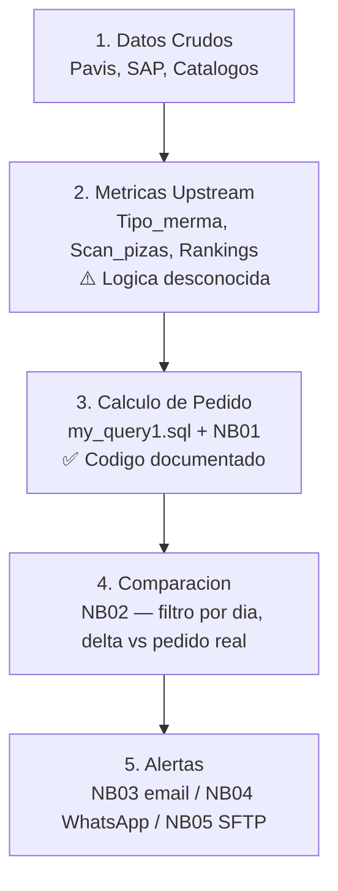
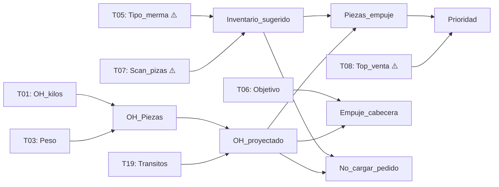
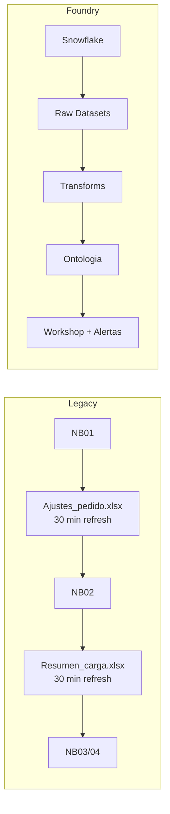
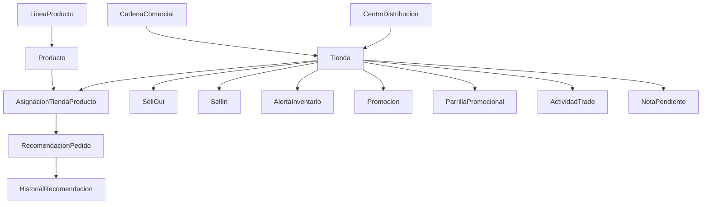
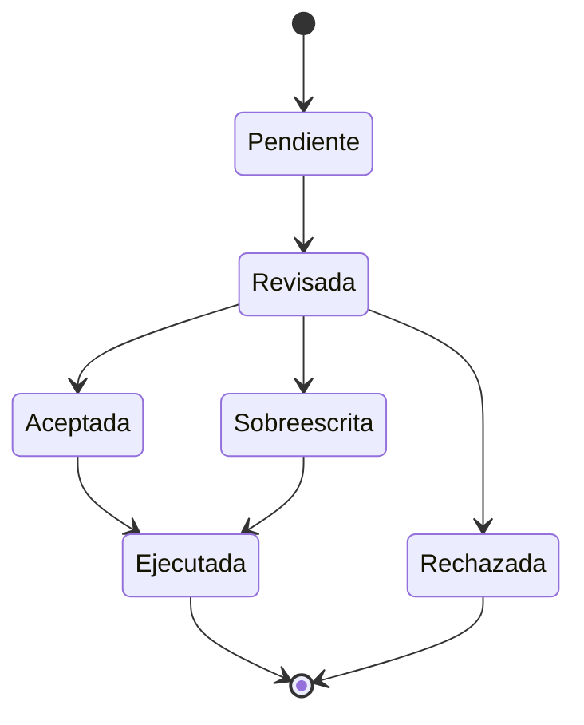

# Pedido Optimo — Analisis del Pipeline y Solicitud de Validacion

**Fecha**: 2026-04-07 | **De**: Solanthic / Alfonso Garrido | **Para**: Enrique Morales
**Contexto**: Migracion del pipeline legacy a Palantir Foundry. Fecha limite de transferencia de conocimiento: **2026-05-04**

---

## 1. Resumen del Proceso que Hemos Identificado

Despues de analizar los **10 queries SQL**, **5 notebooks de Python**, **44 exports estaticos** y **83 datasets en Foundry**, hemos reconstruido el proceso completo del Pedido Optimo. A continuacion presentamos nuestra comprension para que valides si es correcta.

### Vista General del Pipeline

El pipeline opera en 5 etapas secuenciales:

### Linaje de Datos (que tablas alimentan que calculos)

> ⚠️ = logica de generacion desconocida — requiere validacion de Enrique

---

### Detalle por Etapa

#### Etapa 1: Datos Crudos

| Dato                        | Fuente                         | Archivo/Tabla                     | Estado en Foundry                                      |
| --------------------------- | ------------------------------ | --------------------------------- | ------------------------------------------------------ |
| Inventario + ventas diarias | Feed Pavis (scanners retailer) | `sell_out_oh_diarios_28`          | IND_SELL_OUT_OH_DIARIOS_28 — schema listo, **0 filas** |
| Embarques en transito       | SAP (documentos de entrega)    | `transitos.csv` (encoding latin1) | **No existe dataset** — unico sin IND_*                |
| Catalogo de tiendas         | SQL Server                     | `mermas_autos_cat_tienda`         | IND_MERMAS_AUTOS_CAT_TIENDA — schema listo, 0 filas    |
| Catalogo de SKUs            | SQL Server                     | `mermas_autos_cat_sku`            | IND_MERMAS_AUTOS_CAT_SKU — schema listo, 0 filas       |
| Roles de pedido             | SQL Server                     | `Roles_pedido_nacional`           | IND_ROLES_PEDIDO_NACIONAL — schema listo, 0 filas      |
| Directorio WhatsApp         | SQL Server                     | `directorio_whatsapp`             | IND_DIRECTORIO_WHATSAPP — **73 filas**                 |

#### Etapa 2: Metricas Upstream (Black-Box)

Estas tablas contienen resultados computados pero **no tenemos el codigo que las genera**. Son el insumo principal para la Etapa 3 — sin entenderlas, no podemos reconstruir el pipeline completo en Foundry.

| Metrica               | Tabla Fuente                              | Que Sabemos                                                                                                    | Que NO Sabemos                                                               |
| --------------------- | ----------------------------------------- | -------------------------------------------------------------------------------------------------------------- | ---------------------------------------------------------------------------- |
| **Tipo_merma**        | `mermas_autos_test_pedido_sugerido` (T05) | 6 categorias: Ok, Alta, Muy Alta, Scritica, Critica, Inconsistente. Existen granularidades anual y trimestral. | **Umbrales, algoritmo, frecuencia de recalculo**                             |
| **Scan_pizas**        | `Venta_scan_semanal_prom` (T07)           | Velocidad semanal en piezas. Fuente cruda: `sell_out_oh_diarios_28`. "28" sugiere ventana de 28 dias.          | **Metodo exacto de agregacion, manejo de outliers, conversion kilos→piezas** |
| **Top_venta**         | `Sku_insignia` (T08)                      | Flag binario para SKUs top-seller. Usado en Prioridad.                                                         | **Metrica de ranking, alcance (tienda vs CEDI vs nacional), ventana**        |
| **Top_tienda**        | `top_tienda_nacional` (T11)               | Ranking numerico + flag Menor3. Usado en PDFs.                                                                 | **Mismas preguntas que T08 — y es un ranking diferente?**                    |
| **Inventario_optimo** | `mermas_autos_TC_Inventario_optimo` (T16) | Modelo alternativo con DOH, Inv_optimo, Pedido_minimo. Solo 95 filas (Pachuca + clase RL).                     | **Como se calcula? Es mejor que la formula de NB01? Cual usar en Foundry?**  |

**Lo que necesitamos para Foundry:**

Para cada metrica upstream, existen tres caminos posibles en la migracion. Necesitamos definir cual tomar para cada una:

| Metrica               | Opcion A: Importar pre-computada                                                                                               | Opcion B: Replicar la logica en Foundry                                                                                                               | Opcion C: Mejorar/reemplazar                                                                                          |
| --------------------- | ------------------------------------------------------------------------------------------------------------------------------ | ----------------------------------------------------------------------------------------------------------------------------------------------------- | --------------------------------------------------------------------------------------------------------------------- |
| **Tipo_merma**        | Sincronizar T05 tal cual desde SQL Server. Funciona a corto plazo, pero no podemos clasificar SKUs nuevos ni ajustar umbrales. | **Preferimos esta** — necesitamos los umbrales/reglas exactas de Enrique para implementar como transform configurable.                                | Posible: si `POR_MERMA` es el input directo, podriamos hacer la clasificacion parametrizable por familia de producto. |
| **Scan_pizas**        | Sincronizar T07 pre-agregada. Pierde transparencia.                                                                            | **Preferimos esta** — ya tenemos los datos crudos diarios (`sell_out_oh_diarios_28`). Solo necesitamos confirmar el metodo de agregacion con Enrique. | Podemos agregar ventana configurable, outlier detection, y weighted average.                                          |
| **Top_venta**         | Sincronizar T08. Viable a corto plazo.                                                                                         | Necesitamos entender la metrica de ranking.                                                                                                           | Podriamos computar un ranking mas sofisticado (ej. contribucion al margen, no solo volumen).                          |
| **Top_tienda**        | Sincronizar T11. Viable.                                                                                                       | Necesitamos la metodologia.                                                                                                                           | Mismo potencial de mejora que Top_venta.                                                                              |
| **Inventario_optimo** | Sincronizar T16. Pero solo cubre 95 filas (clase RL).                                                                          | Necesitamos entender la formula para generalizarla.                                                                                                   | **Oportunidad clave**: unificar con el modelo NB01 o correr ambos en paralelo y comparar.                             |

**Resumen del ask**: Para avanzar con la construccion en Foundry, necesitamos que Enrique nos proporcione la logica de generacion de estas 5 metricas. **Tipo_merma (E1) y Scan_pizas (E2) son bloqueantes** — sin ellas, el pipeline no puede producir recomendaciones. Top_venta (E4) e Inventario_optimo (E3) son importantes para la calidad del output pero no bloquean la ejecucion basica.

#### Etapa 3: Calculo de Pedido Sugerido

Implementado en `**my_query1.sql`** (Q1) + `**01_RL_TC_con_transitos.ipynb**` (NB01).

**Formulas verificadas linea por linea:**

| Variable              | Formula                                                                                             | Archivo                        | Lineas   |
| --------------------- | --------------------------------------------------------------------------------------------------- | ------------------------------ | -------- |
| `OH_Piezas`           | `OH_kilos / Peso` (GRANEL→2 decimales, otro→0)                                                      | `my_query1.sql`                | L17-24   |
| `Inventario_sugerido` | `(Scan_pizas / 7) * dias` donde Ok=14, Alta=12, Muy Alta=10, Scritica=8, Critica=7, Inconsistente=0 | `my_query1.sql`                | L51-75   |
| `Activa_cliente`      | Flag de combinacion tienda-SKU activa                                                               | `my_query1.sql`                | —        |
| `Puede_pedir_op`      | Flag de operacion habilitada                                                                        | `my_query1.sql`                | —        |
| `Reactivar_operacion` | 1 si Tipo_merma IS NULL AND operacion=1                                                             | `my_query1.sql`                | L87-94   |
| `Reactivar_central`   | 1 si Tipo_merma IS NULL AND operacion=0                                                             | `my_query1.sql`                | L95-104  |
| `Con_cabecera_activa` | 1 si GETDATE() BETWEEN Inicio/Fin vigencia                                                          | `my_query1.sql`                | L109-120 |
| `Con_parrilla_activa` | 1 si GETDATE() BETWEEN Inicio/Fin vigencia                                                          | `my_query1.sql`                | L121-136 |
| `OH_proyectado`       | `OH_Piezas + Piezas_transito` (fillna(0), round 0)                                                  | `01_RL_TC_con_transitos.ipynb` | NB01     |
| `Piezas_empuje`       | `Inv_sugerido - OH_proyectado` solo si Tipo_merma='Ok' AND Inv>OH                                   | `01_RL_TC_con_transitos.ipynb` | NB01     |
| Reduccion Q-FRESCOS   | `Piezas_empuje * 0.33` si linea='Q-FRESCOS'                                                         | `01_RL_TC_con_transitos.ipynb` | NB01     |
| `No_cargar_pedido`    | 1 si Tipo_merma NOT IN (Ok, Alta) AND OH_proy > Inv_sug                                             | `01_RL_TC_con_transitos.ipynb` | NB01     |
| `Prioridad`           | 1=empuje+top_venta, 2=empuje+no_top, 0=sin empuje                                                   | `01_RL_TC_con_transitos.ipynb` | NB01     |
| `Empuje_cabecera`     | `Objetivo_cabecera - OH_proy` si activa y positivo                                                  | `01_RL_TC_con_transitos.ipynb` | NB01     |

#### Etapa 4: Comparacion y Filtrado

Implementado en `**02_Compara_pedidos.ipynb`** (NB02) + `**my_query2.sql**` (Q2).

- Lee `Roles_pedido_nacional` y filtra tiendas donde el dia actual = 1
- Mapea dia de semana ingles → espanol (Monday → Lunes, etc.)
- Compara pedido sugerido vs pedido original del cliente (T18: `proyeccion_detalle_pedidos`)
- Calcula `Piezas_adicionales = Piezas_a_cargar - Pedido_original_cadena`

#### Etapa 5: Alertas y Distribucion

Implementado en **NB03**, **NB04**, **NB05**:

| Notebook | Archivo                               | Funcion                                                                                                                                                                      |
| -------- | ------------------------------------- | ---------------------------------------------------------------------------------------------------------------------------------------------------------------------------- |
| NB03     | `03_envia_alertas_por_mail.ipynb`     | Alertas por email. Acumula `Concentrado_impulso.csv` y `Concentrado_recorte.csv` con deduplicacion historica                                                                 |
| NB04     | `04_envia_alertas_por_whatsapp.ipynb` | Alertas por WhatsApp. Genera PDFs con 4 secciones: azul (impulso), rojo (merma alta), verde (promos), cafe (notas). Excluye Wal-Mart + GRANEL. Ruteo especifico para Soriana |
| NB05     | `05_sube_pdf_a_host.ipynb`            | Sube PDFs generados via SFTP a servidor externo                                                                                                                              |

**Detalle adicional**: Calcula ratio de merma como `(-Merma_promedio / Vol_promedio) * 100` para los PDFs.

---

## 2. Lo Que Necesitamos Validar

### P0 — Bloqueantes para la Migracion a Foundry

#### E1: Logica de Clasificacion de Tipo_merma

**Esta es la variable mas importante del pipeline.** Controla el 100% del calculo de inventario sugerido.

**Lo que sabemos:**

- 6 categorias: Ok, Alta, Muy Alta, Scritica, Critica, Inconsistente
- Existen granularidades anual y trimestral (en `mermas_autos_Tipo_merma_anual`)
- La tabla fuente (`mermas_autos_test_pedido_sugerido`) tiene columnas: SAP, SKU, VOL_BRUTO, VOL_NETO, DBE, DME, PESO, **POR_MERMA**, TIPO_MERMA, SCAN_PROM, PEDIDO_PROM, PRECIO_ACTUAL, PRECIO_ANTERIOR, TIPO_DE_PRECIO, INVENTARIO_SUGERIDO

**Lo que necesitamos:**

1. **Cuales son los umbrales exactos?** Ej: POR_MERMA < 5% = Ok, 5-10% = Alta, etc.?
2. **Es basado en reglas o en un modelo estadistico?**
3. **Que metrica alimenta la clasificacion?** Es `POR_MERMA` el input directo?
4. **El pipeline usa la granularidad trimestral?** (inferimos que si, pero necesitamos confirmacion)
5. **Con que frecuencia se recalcula?** Diario? Semanal? Trimestral?
6. **Como se clasifican SKUs nuevos sin historico?**

**Dato nuevo**: En Foundry descubrimos que `IND_MERMAS_AUTOS_TEST_PEDIDO_SUGERIDO` tiene la columna `POR_MERMA` (porcentaje de merma). Si esta es la metrica de entrada, podriamos cruzarla con `TIPO_MERMA` para reconstruir los umbrales. Confirma si es asi.

---

#### E2: Metodo de Agregacion de Scan_pizas

**Scan_pizas es el denominador de la formula de inventario sugerido.** Pequenas diferencias en la agregacion cambian todas las recomendaciones.

**Lo que sabemos:**

- Tabla pre-agregada: `Venta_scan_semanal_prom` (T07) con columnas SAP, SKU, PESO, SCAN_PIZAS
- Datos crudos diarios: `sell_out_oh_diarios_28` con Fecha, sap, Sku, Scan_kilos
- El "28" sugiere una ventana de 28 dias

**Lo que necesitamos:**

1. **Ventana de agregacion**: Movil 28 dias? Ultimas 4 semanas calendario? Otro?
2. **Conversion de kilos a piezas**: Simple division por Peso? Algun redondeo?
3. **Manejo de outliers**: Se excluyen picos promocionales? Dias con ventas = 0?
4. **Ponderacion**: Promedio simple o ponderado (dias recientes pesan mas)?
5. **SKUs nuevos**: Que pasa si un SKU tiene menos de 28 dias de datos?

**Oportunidad**: En Foundry podemos computar Scan_pizas directamente desde los datos diarios crudos (`IND_SELL_OUT_OH_DIARIOS_28`), haciendolo transparente y configurable. Solo necesitamos confirmar el metodo.

---

#### E3: Inventario_sugerido vs Inventario_optimo — Cual Usar?

**Existen dos modelos diferentes para calcular inventario objetivo:**

| Aspecto                | Modelo NB01 (`my_query1.sql`)       | Modelo TC_RL (`my_query.sql`)                 |
| ---------------------- | ----------------------------------- | --------------------------------------------- |
| Formula                | `(Scan_pizas / 7) * dias_por_merma` | Pre-computado en tabla `TC_Inventario_optimo` |
| Alcance                | Todas las combinaciones tienda-SKU  | Solo Clase='RL' (95 filas en Pachuca)         |
| Empuje para merma alta | Nunca (Tipo_merma != Ok → 0)        | Aplica filtros pero puede empujar             |
| Incluye GRANEL         | Si                                  | No (excluido por filtro)                      |
| Uso operativo          | Si, distribuido diariamente         | Desconocido                                   |

**Lo que necesitamos:**

1. **Cual es el modelo operativo activo?** Usa el equipo NB01, TC_RL, o ambos?
2. **TC_RL es un modelo mas nuevo/mejor que deberia reemplazar a NB01?**
3. **Si ambos estan activos, como se reconcilian las diferencias?**
4. **TC_RL solo cubre Clase='RL' — es intencional?** O deberia extenderse a otras clases?

**Dato nuevo**: En Foundry, `IND_MERMAS_AUTOS_TC_INVENTARIO_OPTIMO` tiene **28 columnas** (vs 95 filas en SOP_PAC_TC_RL). Incluye INV_TEORICO, INVENTARIO_OPTIMO, DOH, NIVELACION_RESURTIDO, RECORTE_RESURTIDO, PEDIDO_MAXIMO, y dimensiones completas de tienda/SKU.

---

### P1 — Importantes

#### E4: Criterios de Ranking (Top_venta y Top_tienda)

Referencia: `my_query3.sql` (Q3) para top_tienda_nacional

1. **Que metrica determina `Top_venta`?** Volumen? Margen? Contribucion?
2. **Alcance**: Por tienda? Por CEDI? Nacional?
3. **Ventana de tiempo**: Ultimos 30 dias? 90 dias? Anual?
4. **Frecuencia de recalculo**: Diario? Semanal?
5. **Cuantos SKUs son "top" por tienda?** Top 10? Top 5% del volumen?
6. `**Top_venta` (T08) y `top_tienda` (T11) son rankings diferentes o derivados del mismo?**

#### E5: Origen de los Datos Diarios de Sell-Out

1. **Cual es la base de datos/tabla en SQL Server que contiene los datos diarios?**
2. **El flujo es: Pavis → SQL Server → ? → sell_out_oh_diarios_28?**
3. **Profundidad historica**: Solo 28 dias moviles, o hay archivos historicos?

#### E6: Tablas Promocionales — Manuales o Calculadas?

| Tabla                          | Archivo         | Pregunta                                          |
| ------------------------------ | --------------- | ------------------------------------------------- |
| `mermas_autos_cabeceras` (T06) | `my_query7.sql` | Captura manual del equipo comercial? O calculada? |
| `parrrillas` (T09)             | —               | Mismo: manual o calculada? Quien mantiene?        |
| `actividad_trade` (T15)        | `my_query8.sql` | Mismo: manual o calculada?                        |

Si son manuales → se migran como datos crudos a Snowflake.
Si son calculadas → necesitamos la logica.

---

### P2 — Confirmaciones

#### E7: 'Scritica' vs 'Critica'

En `my_query1.sql` linea 63, la clausula CASE tiene tanto `'Scritica'` (multiplicador 8 dias) como `'Critica'` (multiplicador 7 dias) como ramas separadas.

**Es 'Scritica' una categoria intencional?** O es una variante historica de escritura (quiza 'Subcritica')?

#### E8: Multiplicador Q-FRESCOS (0.33)

En `01_RL_TC_con_transitos.ipynb`, las Piezas_empuje para productos con linea='Q-FRESCOS' se multiplican por 0.33 (reduccion del 67%).

1. **De donde viene este factor?** Basado en datos de merma/caducidad?
2. **Deberia variar por CEDI o tipo de tienda?** (Ej: tiendas con mejor cadena de frio?)
3. **Hay otras lineas que deberian tener un factor similar?**

#### E9: Multiplicadores de Dias por Tipo_merma

En `my_query1.sql` lineas 51-75: Ok=14, Alta=12, Muy Alta=10, Scritica=8, Critica=7, Inconsistente=0.

1. **Estos multiplicadores estan basados en datos historicos o juicio experto?**
2. **Deberian variar por linea de producto?** (Fresco vs estable)
3. **Deberian variar por tamanio de tienda o CEDI?**

---

## 3. Lo Que Ya Podemos Reconstruir en Foundry

Hemos verificado **todas las formulas** del pipeline contra el codigo fuente. Cada calculo fue validado linea por linea:

| Variable Computada                          | Verificada En                         | Estado |
| ------------------------------------------- | ------------------------------------- | ------ |
| `Inventario_sugerido` (CASE por Tipo_merma) | `my_query1.sql` L51-75                | Exacta |
| `OH_Piezas` (GRANEL=2 dec, otro=0 dec)      | `my_query1.sql` L17-24                | Exacta |
| `OH_proyectado` (fillna + round)            | `01_RL_TC_con_transitos.ipynb`        | Exacta |
| `Piezas_empuje` (solo Ok, Inv>OH)           | `01_RL_TC_con_transitos.ipynb`        | Exacta |
| `No_cargar_pedido` (NOT Ok/Alta AND OH>Inv) | `01_RL_TC_con_transitos.ipynb`        | Exacta |
| `Prioridad` (1/2/0 por empuje+top)          | `01_RL_TC_con_transitos.ipynb`        | Exacta |
| `Empuje_cabecera` (Obj-OH si activa)        | `01_RL_TC_con_transitos.ipynb`        | Exacta |
| `Reactivar_operacion/central` (2 flags)     | `my_query1.sql` L87-104               | Exacta |
| `Con_cabecera/parrilla_activa` (BETWEEN)    | `my_query1.sql` L109-136              | Exacta |
| `Piezas_adicionales` (sugerido-original)    | `02_Compara_pedidos.ipynb`            | Exacta |
| Exclusion Wal-Mart GRANEL                   | `04_envia_alertas_por_whatsapp.ipynb` | Exacta |
| Ratio merma (%) en PDFs                     | `03_envia_alertas_por_mail.ipynb`     | Exacta |
| Ruteo Soriana separado                      | `04_envia_alertas_por_whatsapp.ipynb` | Exacta |

**Conclusion**: Toda la logica desde `my_query1.sql` + NB01-NB05 esta documentada y lista para implementar como transforms de Foundry. Lo que nos falta es la logica **upstream** (E1-E4).

---

## 4. Oportunidades de Mejora para la Migracion

Basado en las sesiones de discovery (marzo 2026) y nuestro analisis del codigo:

### 4.1 Parametrizar Valores Hardcoded

**Problema actual**: Valores criticos estan hardcoded en el SQL y Python.

| Valor                                | Ubicacion                                                               | Propuesta                                                       |
| ------------------------------------ | ----------------------------------------------------------------------- | --------------------------------------------------------------- |
| `CEDI = 'Pachuca'`                   | `my_query1.sql` L160, `my_query3.sql`, `my_query4.sql`, `my_query6.sql` | Parametro de ejecucion en Foundry — correr por CEDI o nacional  |
| `0.33` (Q-FRESCOS)                   | `01_RL_TC_con_transitos.ipynb`                                          | Campo editable en `ProductLine` (factor de reduccion por linea) |
| Dias por Tipo_merma (14/12/10/8/7/0) | `my_query1.sql` L51-75                                                  | Tabla de configuracion editable: `OverrideInventoryPolicy`      |

**Beneficio**: Operaciones puede ajustar sin cambiar codigo. Posibilidad de A/B testing.

### 4.2 Eliminar Intermediarios Excel

**Problema actual** (discutido sesiones 2026-03-26 y 2026-03-30):

**Beneficio**: Elimina 2 puntos de fallo (COM automation), reduce tiempo de ejecucion de ~60 min a minutos, ejecutable en la nube sin dependencia de Windows.

### 4.3 Inventario Fantasma Mejorado

**Discutido en sesion 2026-03-30:**

- Umbral actual: 21 dias universales sin venta → inventario fantasma
- Problema: No diferencia por vida de anaquel o categoria. Produce falsos positivos para cafe, mantequilla (vida larga)
- **Propuesta**: Umbral por SKU basado en patrones historicos de venta (cadencia especifica)
- Afecta ~2% de combinaciones de inventario

### 4.4 Guardrails y Deteccion de Anomalias

Observaciones del codigo:

1. **Sin cap en empuje promocional**: Si `Objetivo_cabecera = 500` pero ventas semanales = 50, el sistema empuja 450 piezas sin validacion
2. **NULL propagation silenciosa**: Si `Scan_pizas` es NULL, `Inventario_sugerido` = NULL → 0 recomendaciones para ese SKU sin alerta
3. **Sin check de estabilidad de Tipo_merma**: Si la clasificacion cambia dia a dia, las recomendaciones oscilan
4. **Sin deteccion de velocidad anomala**: Un spike en Scan_pizas (promo) infla el inventario sugerido

**Propuesta**: Capa de validacion en Foundry que detecte anomalias antes de distribuir alertas.

### 4.5 Unificar Modelos de Inventario

**Problema**: Dos modelos (`my_query1.sql` NB01 vs `my_query.sql` TC_RL) coexisten con metodologias diferentes.

**Propuesta**: Correr ambos en paralelo en Foundry durante 2-4 semanas, comparar contra ordenes reales, y elegir el ganador (o definir ambitos: NB01 para general, TC_RL para refrigerados).

### 4.6 Escalar Mas Alla de Pachuca

Todo el SQL esta filtrado por `CEDI = 'Pachuca'`. Para escalar nacional:

- Parametrizar el CEDI en los transforms
- Fan-out execution por CEDI
- Rankings nacionales (`top_tienda_nacional`) antes del filtro de CEDI

### 4.7 Scan_pizas Nativo en Foundry

En vez de depender de la tabla pre-agregada `Venta_scan_semanal_prom`, computar directamente desde datos diarios crudos con ventana configurable. Esto:

- Hace la agregacion transparente
- Permite comparar diferentes ventanas (28 vs 14 vs 56 dias)
- Resuelve Blindspot E2 una vez confirmado el metodo

### 4.8 Manejo de SKUs Nuevos

Actualmente un SKU sin `Scan_pizas` o sin `Tipo_merma` genera 0 recomendaciones silenciosamente. Propuesta: logica de "onboarding" que use baseline por familia/linea hasta acumular datos propios.

---

## 5. Datasets Disponibles en Foundry

Hemos sincronizado **83 datasets** desde Snowflake. Descubrimos una nueva familia de tablas `IND_`* que cubren **todas las tablas del pipeline** (T01-T17):

### Tablas IND_* — Schemas Listos (Cubren T01-T17)

| Pipeline | Tabla                            | Dataset Foundry                       | Filas   | Schema                                                            |
| -------- | -------------------------------- | ------------------------------------- | ------- | ----------------------------------------------------------------- |
| **T01**  | sell_out_oh_diarios_28           | IND_SELL_OUT_OH_DIARIOS_28            | **0**   | FECHA, SAP, SKU, OH_KILOS, SCAN_KILOS                             |
| **T03**  | cat_sku                          | IND_MERMAS_AUTOS_CAT_SKU              | **0**   | SKU, PRODUCTO, PESO, FAMILIA, LINEA, PRESENTACION, MARCA + 8 mas  |
| **T04**  | activo_tienda                    | IND_MERMAS_AUTOS_CAT_ACTIVO_TIENDA    | **0**   | SAP, SKU, OPERACION                                               |
| **T05**  | pedido_sugerido                  | IND_MERMAS_AUTOS_TEST_PEDIDO_SUGERIDO | **0**   | SAP, SKU, TIPO_MERMA, **POR_MERMA**, INVENTARIO_SUGERIDO + 10 mas |
| **T06**  | cabeceras                        | IND_MERMAS_AUTOS_CABECERAS            | **0**   | SAP, SKU, OBJETIVO_OH, INICIO/FIN_VIGENCIA + 11 mas               |
| **T07**  | venta_scan                       | IND_VENTA_SCAN_SEMANAL_PROM           | **0**   | SAP, SKU, PESO, SCAN_PIZAS                                        |
| **T08**  | sku_insignia                     | IND_SKU_INSIGNIA                      | **0**   | SAP, SKU, TOP_VENTA, TIPO_MERMA_ANUAL, TIPO_MERMA_TRIMESTRAL      |
| **T09**  | parrrillas                       | IND_PARRRILLAS                        | **0**   | SAP, SKU, PARRILLA, INICIO/FIN_VIGENCIA                           |
| **T10**  | roles_pedido                     | IND_ROLES_PEDIDO_NACIONAL             | **0**   | SAP, LUNES-SABADO                                                 |
| **T11**  | top_tienda                       | IND_TOP_TIENDA_NACIONAL               | **0**   | SAP, SKU, TOP_TIENDA, MENOR3 + 5 mas                              |
| **T12**  | directorio_whatsapp              | IND_DIRECTORIO_WHATSAPP               | **73**  | SAP, CEL_EJECUTIVO, CEL_COORDINADORA + 2 promotoras               |
| **T15**  | actividad_trade                  | IND_ACTIVIDAD_TRADE                   | **673** | SAP, SKU, PRODUCTO, DESC_TRADE, INICIO/FIN_VIGENCIA               |
| **T16**  | inventario_optimo                | IND_MERMAS_AUTOS_TC_INVENTARIO_OPTIMO | **0**   | 28 columnas incl. INV_TEORICO, INVENTARIO_OPTIMO, DOH             |
| **T17**  | ItemReview_TD                    | IND_MERMAS_AUTOS_ITEMREVIEW_TD        | **0**   | 67 columnas (forecasting Walmart)                                 |
| **—**    | Ajustes_pedido (output completo) | IND_AJUSTES_PEDIDO                    | **0**   | **42 columnas** = output completo del pipeline legacy             |

### Tablas SOP_* con Datos

| Dataset                        | Filas   | Pipeline                   |
| ------------------------------ | ------- | -------------------------- |
| SOP_PAC_CAT_TIENDAS            | 104     | T02 (Pachuca)              |
| SOP_PAC_NOTAS_PENDIENTES       | 384     | T13                        |
| SOP_PAC_PEDIDO_BASE            | 185     | T03/T05/T07/T08 (1 tienda) |
| SOP_PAC_TC_RL                  | 95      | T16 (Pachuca + RL)         |
| SOP_PROYECCION_DETALLE_PEDIDOS | — (403) | T18                        |
| SOP_PAC_CAT_ACTIVO_TIENDA      | — (403) | T04                        |

### Accion Requerida para Victor

**Disparar los syncs de todas las tablas IND_*** — los schemas estan listos, solo necesitan ejecutarse para traer datos. Una vez con datos, tendremos **todas las tablas T01-T17** en Foundry.

**T19 (transitos) no tiene dataset** — es el unico que necesita crearse desde cero (fuente SAP).

---

## 6. Ontologia Propuesta para Foundry

Para soportar este proceso en Foundry, hemos disenado una ontologia con **15 tipos de objeto**, **22 relaciones** y **12 acciones**. Aqui presentamos la vision de como el sistema operara.

### Diagrama de Entidades

### Capas de la Ontologia

#### A. Datos Maestros (5 objetos)

| Objeto                            | Clave    | Fuente Pipeline       | Descripcion                                                                                              |
| --------------------------------- | -------- | --------------------- | -------------------------------------------------------------------------------------------------------- |
| **Tienda** (Store)                | sapCode  | T02 + T10 + T12       | Catalogo de tiendas con configuracion de pedido (dias habiles, telefonos de contacto)                    |
| **Producto** (Product)            | sku      | T03                   | Catalogo SKU con Peso (para conversion kg→pzas), Familia, Linea, Presentacion, Marca                     |
| **CentroDistribucion**            | cediCode | T02 (distinct Cedi)   | CEDIs                                                                                                    |
| **CadenaComercial** (RetailChain) | chainId  | T02 (distinct Cadena) | Cadenas con formato de alerta y modelo de ejecucion (institucional/promotor/hibrido)                     |
| **LineaProducto** (ProductLine)   | lineId   | T03 (distinct Linea)  | Lineas de producto con **factor de reduccion configurable** (Q-FRESCOS=0.33 como parametro, no hardcode) |

#### B. Relacion Central (1 objeto)

**AsignacionTiendaProducto** (StoreProductAssignment) — clave: `{sapCode}_{sku}`

Este es el **corazon del sistema**. Combina:

- **Configuracion editable** (ajustable por usuario):
  - `diasObjetivoInventario` (default segun clasificacion de merma, sobreescribible)
  - `estaActiva`, `flagOperacion`, `requiereReactivacion`
- **Metricas del pipeline** (computadas, solo lectura):
  - `inventarioProyectado` (OH + transito)
  - `inventarioObjetivo` (segun politica)
  - `piezasEmpuje` (con reduccion Q-FRESCOS aplicada)
  - `flagRecorte` (cuando merma alta y sobreinventario)
  - `clasificacionMerma` (Ok/Alta/MuyAlta/Subcritica/Critica/Inconsistente)
  - `ventaPromedioPiezas`, `porcentajeMerma`, `prioridad`, `esInsignia`

**Mapeo**: T04 (activo_tienda) + T05 (pedido_sugerido) + campos computados de NB01

#### C. Senales de Demanda y Oferta (2 objetos)

| Objeto      | Clave                 | Fuente                          | Descripcion                                                                |
| ----------- | --------------------- | ------------------------------- | -------------------------------------------------------------------------- |
| **SellOut** | `{sap}_{sku}_{fecha}` | T01 (sell_out_oh_diarios_28)    | Senal de demanda: venta diaria + posicion de inventario por tienda-SKU-dia |
| **SellIn**  | `{sap}_{sku}_{fecha}` | T18 (ordenes) + T19 (transitos) | Senal de oferta: pedidos de cadena + embarques en transito                 |

#### D. Recomendaciones (2 objetos)

| Objeto                                             | Descripcion                                                                                                                                         |
| -------------------------------------------------- | --------------------------------------------------------------------------------------------------------------------------------------------------- |
| **RecomendacionPedido** (OrderRecommendation)      | Recomendacion viva por tienda-SKU. Una sola recomendacion activa por combinacion. Ciclo de vida completo:                                           |
| **HistorialRecomendacion** (RecommendationHistory) | Registro append-only. Cada vez que el pipeline recalcula, se archiva el estado anterior con la decision tomada. Para auditoria y mejora del modelo. |

### Ciclo de Vida de una Recomendacion

#### E. Alertas (1 objeto)

**AlertaInventario** — alerta diaria por tienda cuando existen desalineaciones de inventario. Incluye:

- Resumen de gaps: total SKUs con empuje, total con recorte, severidad
- Canal de distribucion: WhatsApp / email / dashboard
- Ciclo: generada → distribuida → reconocida → resuelta

#### F. Contexto Promocional (3 objetos)

| Objeto                  | Fuente                | Funcion                                                                  |
| ----------------------- | --------------------- | ------------------------------------------------------------------------ |
| **Promocion**           | T06 (cabeceras)       | Objetivos de inventario para cabeceras activas. Drives `Empuje_cabecera` |
| **ParrillaPromocional** | T09 (parrrillas)      | Membresía en parrillas con vigencia. Informativo                         |
| **ActividadTrade**      | T15 (actividad_trade) | Eventos trade con precios sugeridos y vigencia. Mostrado en PDFs         |

#### G. Financiero (1 objeto)

**NotaPendiente** — T13 (notas_pendientes). Notas de credito/debito por tienda. Contexto en alertas.

### Acciones Disponibles (12)

| Accion                            | Tipo    | Descripcion                                     |
| --------------------------------- | ------- | ----------------------------------------------- |
| `AprobarRecomendacion`            | Regla   | Acepta recomendacion pendiente/revisada         |
| `RechazarRecomendacion`           | Regla   | Rechaza con razon obligatoria                   |
| `SobreescribirCantidad`           | Regla   | Ajusta manualmente la cantidad sugerida         |
| `AprobacionMasiva`                | Funcion | Aprueba multiples recomendaciones en lote       |
| `SobreescribirForecast`           | Regla   | Ajuste de forecast especifico para Walmart      |
| `ReconocerAlerta`                 | Regla   | Marca alerta como vista                         |
| `ResolverAlerta`                  | Regla   | Marca alerta como resuelta (notas obligatorias) |
| `SobreescribirPoliticaInventario` | Regla   | Cambia `diasObjetivoInventario` por tienda-SKU  |
| `ActivarTienda`                   | Regla   | Reactiva tienda                                 |
| `DesactivarTienda`                | Funcion | Desactiva tienda + cascada a asignaciones       |
| `ActivarTiendaProducto`           | Regla   | Activa asignacion tienda-SKU                    |
| `DesactivarTiendaProducto`        | Regla   | Desactiva asignacion (razon obligatoria)        |

### Mapeo Ontologia ← Pipeline

| Objeto Ontologia             | Tablas Pipeline Fuente                                               |
| ---------------------------- | -------------------------------------------------------------------- |
| **Tienda**                   | T02 (cat_tienda) + T10 (roles_pedido) + T12 (directorio_whatsapp)    |
| **Producto**                 | T03 (cat_sku)                                                        |
| **AsignacionTiendaProducto** | T04 (activo_tienda) + T05 (pedido_sugerido) + campos computados NB01 |
| **SellOut**                  | T01 (sell_out_oh_diarios_28)                                         |
| **SellIn**                   | T18 (proyeccion_pedidos) + T19 (transitos)                           |
| **RecomendacionPedido**      | Generada por AsignacionTiendaProducto (pipeline output)              |
| **Promocion**                | T06 (cabeceras)                                                      |
| **ParrillaPromocional**      | T09 (parrrillas)                                                     |
| **ActividadTrade**           | T15 (actividad_trade)                                                |
| **NotaPendiente**            | T13 (notas_pendientes)                                               |

---

## Proximos Pasos

1. **Enrique**: Revisar este documento y responder E1-E9 antes del 2026-05-04
2. **Victor**: Disparar syncs de los datasets IND_* + crear dataset para T19 (transitos)
3. **Solanthic**: Comenzar implementacion de transforms en Foundry con la logica documentada (Etapas 3-5)

---

*Documentacion tecnica completa: `context/DATA_READINESS_REPORT.md` | Formulas: `context/COMPUTATION_GRAPH.md` | Inventario de tablas: `context/TABLE_INVENTORY.md` | Ontologia: `ontology/OVERVIEW.md`*